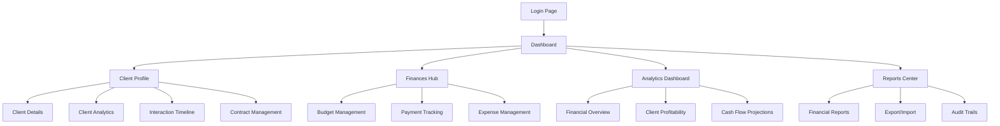

# Advanced Client Management System - Product Requirements Document

## 1. Product Overview
A comprehensive client management system that integrates detailed client profiles with advanced financial tracking, analytics, and reporting capabilities. The system provides complete visibility into client relationships, financial performance, and business profitability through integrated dashboards and real-time analytics.

This platform addresses the critical need for businesses to track client profitability, manage budgets effectively, and maintain comprehensive financial oversight while providing detailed client relationship management capabilities.

The system targets small to medium businesses, agencies, and service providers who need integrated client and financial management with advanced analytics and reporting capabilities.

## 2. Core Features

### 2.1 User Roles
All users have full access to all system modules and features. The existing user authentication system will be used without role-based restrictions, allowing all authenticated users to view and manage clients, finances, analytics, and reports.

### 2.2 Feature Module
Our advanced client management system consists of the following main modules:

1. **Client Profile Management**: comprehensive client records, contact management, interaction history, contract tracking
2. **Client Analytics Dashboard**: revenue tracking, profitability analysis, performance metrics, historical trends
3. **Financial Management Hub**: budget tracking, payment management, expense tracking, financial reporting
4. **Company Analytics Dashboard**: overall financial health, client comparisons, cash flow projections, business intelligence
5. **Reports & Export Center**: financial reports generation, data export/import, audit trails
6. **User Management**: role-based access control, permissions management, user activity tracking

### 2.3 Page Details

| Page Name | Module Name | Feature description |
|-----------|-------------|---------------------|
| Client Profile | Client Information | Display complete client details including contact info, company details, contracts, and relationship history |
| Client Profile | Client Analytics | Show client-specific revenue, acquisition costs, budget allocation vs spending, profitability metrics, and performance trends |
| Client Profile | Interaction Timeline | Track all client interactions, meetings, calls, emails, and project milestones |
| Client Profile | Contract Management | Manage client contracts, renewals, terms, and billing arrangements |
| Finances Dashboard | Budget Overview | Display company-wide budget allocation, spending tracking, and budget vs actual comparisons |
| Finances Dashboard | Budget Management | Create, edit, and monitor budgets by department, client, or project with visual progress indicators |
| Payment Management | Payment Tracking | Record incoming payments, track payment status, manage payment schedules and due dates |
| Payment Management | Payment History | Comprehensive payment history with receipts, payment methods, and transaction details |
| Payment Management | Invoice Management | Generate, send, and track invoices with automated payment reminders |
| Expense Tracking | Expense Recording | Categorized expense entry with receipt uploads, vendor information, and approval workflows |
| Expense Tracking | Vendor Management | Manage vendor relationships, payment terms, and vendor payment tracking |
| Expense Tracking | Expense Analytics | Analyze spending patterns, category breakdowns, and expense trends |
| Analytics Dashboard | Financial Overview | Company-wide financial health indicators, revenue vs expenses, profit margins |
| Analytics Dashboard | Client Profitability | Compare client profitability, identify top-performing clients, analyze client value |
| Analytics Dashboard | Cash Flow Projections | Forecast cash flow based on scheduled payments, expenses, and historical data |
| Analytics Dashboard | Performance Metrics | Key performance indicators, growth metrics, and business intelligence insights |
| Reports Center | Financial Reports | Generate comprehensive financial reports including P&L, balance sheets, client reports |
| Reports Center | Export/Import | Data export capabilities for accounting software integration and report sharing |
| Reports Center | Audit Trails | Complete transaction history, user activity logs, and compliance reporting |
| User Management | User Profiles | Manage user profile information, preferences, and account settings |
| User Management | Activity Monitoring | Track user activities, login history, and system usage analytics |

## 3. Core Process

### User Flow
All authenticated users can access the complete system functionality including client management, financial tracking, analytics, and reporting. Users can manage client profiles, track interactions, create and monitor budgets, record payments and expenses, generate reports, and access all analytics dashboards. The system provides a unified experience where users can seamlessly navigate between client management and financial features.

## 4. User Interface Design

### 4.1 Design Style
- **Primary Colors**: Professional blue (#2563eb) and success green (#10b981)
- **Secondary Colors**: Neutral grays (#6b7280, #f3f4f6) and warning amber (#f59e0b)
- **Button Style**: Rounded corners with subtle shadows, gradient backgrounds for primary actions
- **Font**: Inter or system fonts, 14px base size, 16px for headings, 12px for secondary text
- **Layout Style**: Card-based design with clean spacing, sidebar navigation, and tabbed interfaces
- **Icons**: Heroicons or Lucide icons for consistency, financial-specific icons for monetary data

### 4.2 Page Design Overview

| Page Name | Module Name | UI Elements |
|-----------|-------------|-------------|
| Client Profile | Client Information | Clean card layout with avatar, contact details, and quick action buttons. Tabbed interface for different sections |
| Client Profile | Client Analytics | Dashboard-style layout with KPI cards, charts (line, bar, pie), and data tables with sorting/filtering |
| Finances Dashboard | Budget Overview | Progress bars for budget tracking, color-coded status indicators, interactive charts with drill-down capabilities |
| Payment Management | Payment Tracking | Table view with status badges, search/filter functionality, modal forms for payment entry |
| Expense Tracking | Expense Recording | Form-based interface with file upload, category dropdowns, approval workflow indicators |
| Analytics Dashboard | Financial Overview | Executive dashboard with large KPI cards, trend charts, and comparative visualizations |
| Reports Center | Financial Reports | Report builder interface with date pickers, filter options, and preview functionality |

### 4.3 Responsiveness
The system is desktop-first with mobile-adaptive design. Key financial data and client information are optimized for tablet viewing. Touch interactions are optimized for mobile expense entry and payment tracking. Responsive charts and tables adapt to different screen sizes while maintaining data readability.