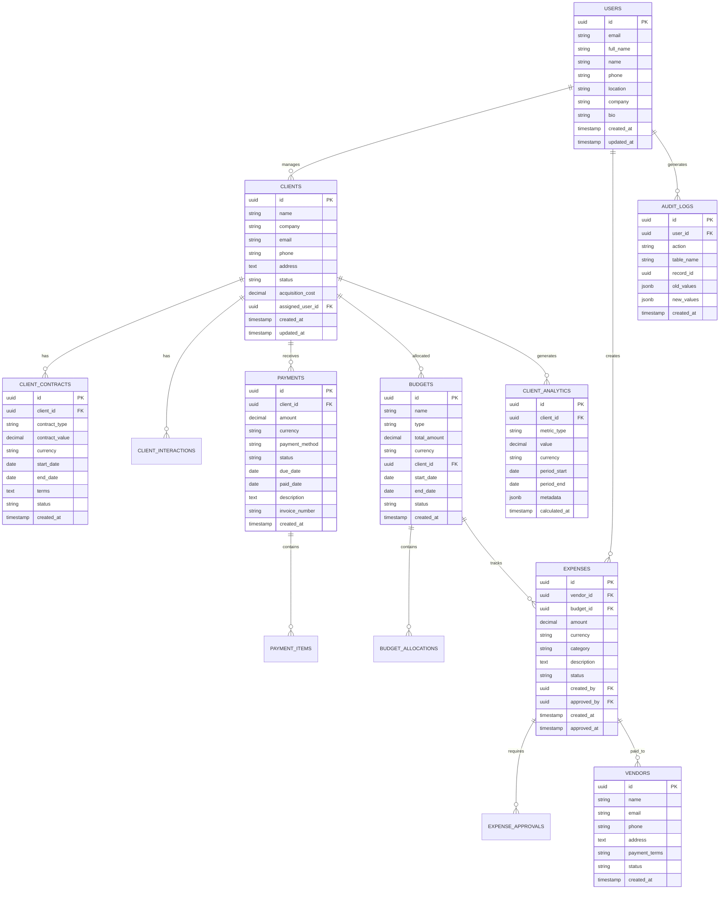

# Advanced Client Management System - Technical Architecture Document

## 1. Architecture Design


## 2. Technology Description

* Frontend: React\@18 + TypeScript + TailwindCSS\@3 + Vite + Chart.js + React Query

* Backend: Express\@4 + TypeScript + Node.js\@18

* Database: Supabase (PostgreSQL)

* Cache: Redis for session management and analytics caching

* File Storage: Supabase Storage for receipts and documents

* Authentication: Supabase Auth

* External APIs: Currency exchange rates, email notifications

## 3. Route Definitions

| Route                    | Purpose                                                        |
| ------------------------ | -------------------------------------------------------------- |
| /dashboard               | Main dashboard with financial overview and quick access        |
| /clients                 | Client list view with search and filtering capabilities        |
| /clients/:id             | Detailed client profile with analytics and interaction history |
| /clients/:id/analytics   | Client-specific analytics dashboard                            |
| /finances                | Financial management hub with budget, payments, and expenses   |
| /finances/budgets        | Budget creation, monitoring, and allocation management         |
| /finances/payments       | Payment tracking, invoicing, and payment history               |
| /finances/expenses       | Expense recording, approval workflows, and vendor management   |
| /analytics               | Company-wide analytics and business intelligence dashboard     |
| /analytics/profitability | Client profitability analysis and comparisons                  |
| /analytics/cashflow      | Cash flow projections and financial forecasting                |
| /reports                 | Report generation center with export capabilities              |
| /reports/financial       | Financial report builder and templates                         |
| /reports/audit           | Audit trails and compliance reporting                          |
| /settings                | User profile management and system preferences                 |

## 4. API Definitions

### 4.1 Core API

**Client Management**

```
GET /api/clients
POST /api/clients
GET /api/clients/:id
PUT /api/clients/:id
DELETE /api/clients/:id
GET /api/clients/:id/analytics
GET /api/clients/:id/contracts
POST /api/clients/:id/interactions
```

**Financial Management**

```
GET /api/finances/budgets
POST /api/finances/budgets
PUT /api/finances/budgets/:id
GET /api/finances/payments
POST /api/finances/payments
PUT /api/finances/payments/:id
GET /api/finances/expenses
POST /api/finances/expenses
PUT /api/finances/expenses/:id/approve
```

**Analytics & Reporting**

```
GET /api/analytics/dashboard
GET /api/analytics/client-profitability
GET /api/analytics/cashflow-projection
GET /api/reports/financial/:type
POST /api/reports/export
GET /api/audit/transactions
```

### 4.2 API Request/Response Examples

**Client Analytics Request:**

```
GET /api/clients/123/analytics?period=12months
```

Request Headers:

| Header Name   | Header Type | isRequired | Description                     |
| ------------- | ----------- | ---------- | ------------------------------- |
| Authorization | string      | true       | Bearer token for authentication |
| Content-Type  | string      | true       | application/json                |

Response:

| Param Name    | Param Type | Description                           |
| ------------- | ---------- | ------------------------------------- |
| revenue       | object     | Total revenue and breakdown by period |
| expenses      | object     | Client-specific expenses and costs    |
| profitability | object     | Profit margins and ROI metrics        |
| trends        | array      | Historical performance data           |

Example Response:

```json
{
  "revenue": {
    "total": 125000.50,
    "currency": "USD",
    "breakdown": [
      {"month": "2024-01", "amount": 10500.00},
      {"month": "2024-02", "amount": 12300.00}
    ]
  },
  "expenses": {
    "acquisition_cost": 5000.00,
    "operational_cost": 15000.00,
    "total": 20000.00
  },
  "profitability": {
    "gross_profit": 105000.50,
    "margin_percentage": 84.0,
    "roi": 525.0
  }
}
```

## 5. Server Architecture Diagram


## 6. Data Model

### 6.1 Data Model Definition



### 6.2 Data Definition Language

**Users Table**

```sql
-- Create users table (using existing structure)
CREATE TABLE users (
    id UUID PRIMARY KEY DEFAULT gen_random_uuid(),
    email VARCHAR(255) UNIQUE NOT NULL,
    full_name VARCHAR(100) NOT NULL,
    name VARCHAR(100),
    phone VARCHAR(30),
    location VARCHAR(200),
    company VARCHAR(100),
    bio TEXT,
    avatar_url TEXT,
    created_at TIMESTAMP WITH TIME ZONE DEFAULT NOW(),
    updated_at TIMESTAMP WITH TIME ZONE DEFAULT NOW()
);

-- Create clients table with financial tracking
CREATE TABLE clients (
    id UUID PRIMARY KEY DEFAULT gen_random_uuid(),
    name VARCHAR(100) NOT NULL,
    company VARCHAR(100),
    email VARCHAR(255),
    phone VARCHAR(30),
    address TEXT,
    status VARCHAR(20) DEFAULT 'active' CHECK (status IN ('active', 'inactive', 'prospect', 'churned')),
    acquisition_cost DECIMAL(12,2) DEFAULT 0,
    assigned_user_id UUID REFERENCES users(id),
    created_at TIMESTAMP WITH TIME ZONE DEFAULT NOW(),
    updated_at TIMESTAMP WITH TIME ZONE DEFAULT NOW()
);

-- Create client contracts table
CREATE TABLE client_contracts (
    id UUID PRIMARY KEY DEFAULT gen_random_uuid(),
    client_id UUID REFERENCES clients(id) ON DELETE CASCADE,
    contract_type VARCHAR(50) NOT NULL,
    contract_value DECIMAL(12,2) NOT NULL,
    currency VARCHAR(3) DEFAULT 'USD',
    start_date DATE NOT NULL,
    end_date DATE,
    terms TEXT,
    status VARCHAR(20) DEFAULT 'active' CHECK (status IN ('draft', 'active', 'expired', 'terminated')),
    created_at TIMESTAMP WITH TIME ZONE DEFAULT NOW()
);

-- Create budgets table
CREATE TABLE budgets (
    id UUID PRIMARY KEY DEFAULT gen_random_uuid(),
    name VARCHAR(100) NOT NULL,
    type VARCHAR(20) CHECK (type IN ('company', 'client', 'project', 'department')),
    total_amount DECIMAL(12,2) NOT NULL,
    currency VARCHAR(3) DEFAULT 'USD',
    client_id UUID REFERENCES clients(id),
    start_date DATE NOT NULL,
    end_date DATE NOT NULL,
    status VARCHAR(20) DEFAULT 'active' CHECK (status IN ('draft', 'active', 'completed', 'cancelled')),
    created_at TIMESTAMP WITH TIME ZONE DEFAULT NOW()
);

-- Create payments table
CREATE TABLE payments (
    id UUID PRIMARY KEY DEFAULT gen_random_uuid(),
    client_id UUID REFERENCES clients(id) ON DELETE CASCADE,
    amount DECIMAL(12,2) NOT NULL,
    currency VARCHAR(3) DEFAULT 'USD',
    payment_method VARCHAR(50),
    status VARCHAR(20) DEFAULT 'pending' CHECK (status IN ('pending', 'paid', 'overdue', 'cancelled')),
    due_date DATE,
    paid_date DATE,
    description TEXT,
    invoice_number VARCHAR(50),
    receipt_url TEXT,
    created_at TIMESTAMP WITH TIME ZONE DEFAULT NOW()
);

-- Create vendors table
CREATE TABLE vendors (
    id UUID PRIMARY KEY DEFAULT gen_random_uuid(),
    name VARCHAR(100) NOT NULL,
    email VARCHAR(255),
    phone VARCHAR(30),
    address TEXT,
    payment_terms VARCHAR(50),
    status VARCHAR(20) DEFAULT 'active' CHECK (status IN ('active', 'inactive')),
    created_at TIMESTAMP WITH TIME ZONE DEFAULT NOW()
);

-- Create expenses table
CREATE TABLE expenses (
    id UUID PRIMARY KEY DEFAULT gen_random_uuid(),
    vendor_id UUID REFERENCES vendors(id),
    budget_id UUID REFERENCES budgets(id),
    amount DECIMAL(12,2) NOT NULL,
    currency VARCHAR(3) DEFAULT 'USD',
    category VARCHAR(50) NOT NULL,
    description TEXT,
    status VARCHAR(20) DEFAULT 'pending' CHECK (status IN ('pending', 'approved', 'rejected', 'paid')),
    receipt_url TEXT,
    created_by UUID REFERENCES users(id),
    approved_by UUID REFERENCES users(id),
    created_at TIMESTAMP WITH TIME ZONE DEFAULT NOW(),
    approved_at TIMESTAMP WITH TIME ZONE
);

-- Create client analytics table
CREATE TABLE client_analytics (
    id UUID PRIMARY KEY DEFAULT gen_random_uuid(),
    client_id UUID REFERENCES clients(id) ON DELETE CASCADE,
    metric_type VARCHAR(50) NOT NULL,
    value DECIMAL(12,2) NOT NULL,
    currency VARCHAR(3) DEFAULT 'USD',
    period_start DATE NOT NULL,
    period_end DATE NOT NULL,
    metadata JSONB DEFAULT '{}',
    calculated_at TIMESTAMP WITH TIME ZONE DEFAULT NOW()
);

-- Create audit logs table
CREATE TABLE audit_logs (
    id UUID PRIMARY KEY DEFAULT gen_random_uuid(),
    user_id UUID REFERENCES users(id),
    action VARCHAR(50) NOT NULL,
    table_name VARCHAR(50) NOT NULL,
    record_id UUID,
    old_values JSONB,
    new_values JSONB,
    ip_address INET,
    user_agent TEXT,
    created_at TIMESTAMP WITH TIME ZONE DEFAULT NOW()
);

-- Create indexes for performance
CREATE INDEX idx_clients_assigned_user ON clients(assigned_user_id);
CREATE INDEX idx_clients_status ON clients(status);
CREATE INDEX idx_payments_client_id ON payments(client_id);
CREATE INDEX idx_payments_due_date ON payments(due_date);
CREATE INDEX idx_expenses_budget_id ON expenses(budget_id);
CREATE INDEX idx_expenses_status ON expenses(status);
CREATE INDEX idx_client_analytics_client_id ON client_analytics(client_id);
CREATE INDEX idx_client_analytics_period ON client_analytics(period_start, period_end);
CREATE INDEX idx_audit_logs_user_id ON audit_logs(user_id);
CREATE INDEX idx_audit_logs_created_at ON audit_logs(created_at DESC);

-- Grant permissions for authenticated users
GRANT SELECT ON ALL TABLES IN SCHEMA public TO anon;
GRANT ALL PRIVILEGES ON ALL TABLES IN SCHEMA public TO authenticated;
```

