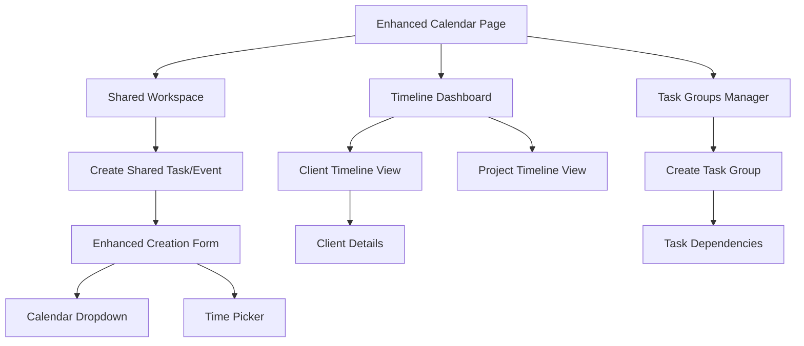

# Empty CRM Calendar Enhancement Requirements

## 1. Product Overview

This document outlines enhancements to the Empty CRM calendar system to improve team collaboration and task management efficiency. The enhancements focus on shared task/event management, timeline visualization, task combination workflows, and improved user experience for date-time input.

The target is to transform the current individual-focused calendar into a collaborative workspace that enables better team coordination, project tracking, and client relationship management through enhanced timeline views and task grouping capabilities.

## 2. Core Features

### 2.1 User Roles

| Role | Registration Method | Core Permissions |
|------|---------------------|------------------|
| CEO | Pre-configured account | Full access to all shared tasks, events, and timelines; can create task groups and assign team members |
| CGO | Pre-configured account | Can create and manage shared tasks/events; access to client timelines and task combinations |
| CTO | Pre-configured account | Can create and manage shared tasks/events; access to technical task groups and project timelines |

### 2.2 Feature Module

Our enhanced calendar system consists of the following main pages:

1. **Enhanced Calendar Page**: Individual and shared task/event views, timeline integration, task combination interface
2. **Shared Workspace**: Dedicated section for mutual tasks and collaborative events
3. **Timeline Dashboard**: Client-based and task-based timeline visualization
4. **Task Groups Manager**: Interface for combining and managing related tasks
5. **Enhanced Task/Event Creation**: Improved forms with dropdown calendar and time picker components

### 2.3 Page Details

| Page Name | Module Name | Feature Description |
|-----------|-------------|---------------------|
| Enhanced Calendar Page | Shared Tasks Section | Display mutual tasks and events visible to all team members; filter by assignee, priority, and sharing status |
| Enhanced Calendar Page | Timeline Integration | Embedded timeline view showing task progression and client interaction history |
| Enhanced Calendar Page | Task Combination Interface | Quick access to create task groups and link related tasks together |
| Shared Workspace | Collaborative Task Board | Kanban-style board for shared tasks with drag-and-drop functionality; real-time updates |
| Shared Workspace | Team Event Calendar | Collective calendar view showing all team events and meetings |
| Shared Workspace | Assignment Management | Interface to assign shared tasks to team members and track progress |
| Timeline Dashboard | Client Timeline View | Chronological view of all interactions, tasks, and events related to specific clients |
| Timeline Dashboard | Project Timeline View | Task-based timeline showing project progression and dependencies |
| Timeline Dashboard | Team Activity Timeline | Overview of all team activities and milestones |
| Task Groups Manager | Group Creation | Create and configure task groups with related tasks and dependencies |
| Task Groups Manager | Workflow Management | Define task sequences and automatic progression rules |
| Task Groups Manager | Progress Tracking | Monitor completion status of task groups and individual components |
| Enhanced Task/Event Creation | Calendar Dropdown | Interactive calendar picker with month/year navigation and date selection |
| Enhanced Task/Event Creation | Time Picker Component | Dropdown time selector with hour/minute precision and AM/PM toggle |
| Enhanced Task/Event Creation | Sharing Options | Configure task/event visibility and collaboration settings |

## 3. Core Process

### Regular User Flow
1. User accesses Enhanced Calendar Page to view personal and shared tasks/events
2. User can switch between individual view and shared workspace
3. User creates new tasks/events using enhanced date-time picker components
4. User can assign tasks to team members and configure sharing settings
5. User combines related tasks into task groups for better organization
6. User monitors progress through timeline dashboard views

### Collaborative Workflow
1. Team member creates shared task/event in Shared Workspace
2. Other team members receive notifications and can view in their calendars
3. Tasks can be assigned, reassigned, and updated collaboratively
4. Progress is tracked through timeline views and task group status
5. Completed tasks update client timelines and project progression



## 4. User Interface Design

### 4.1 Design Style
- **Primary Colors**: Pink (#EC4899) for primary actions, Purple (#8B5CF6) for secondary elements
- **Secondary Colors**: Gray (#6B7280) for text, Blue (#3B82F6) for information elements
- **Button Style**: Rounded corners (8px radius) with subtle shadows and hover effects
- **Font**: Inter or system fonts, 14px base size for body text, 16px for form inputs
- **Layout Style**: Card-based design with clean spacing, top navigation with tab-style switching
- **Icons**: Lucide React icons for consistency, 16px-20px sizes for UI elements

### 4.2 Page Design Overview

| Page Name | Module Name | UI Elements |
|-----------|-------------|-------------|
| Enhanced Calendar Page | Shared Tasks Section | Toggle switch for shared/personal view; color-coded task indicators (blue for shared, gray for personal); team member avatars on shared tasks |
| Enhanced Calendar Page | Timeline Integration | Collapsible timeline panel on right side; horizontal timeline with milestone markers; client/project filter dropdown |
| Shared Workspace | Collaborative Task Board | Three-column Kanban layout (To Do, In Progress, Done); drag-and-drop cards with team member assignments; real-time update indicators |
| Timeline Dashboard | Client Timeline View | Vertical timeline with client interaction cards; expandable details; filter by interaction type and date range |
| Task Groups Manager | Group Creation | Modal dialog with task selection checkboxes; dependency mapping interface; progress visualization with completion percentages |
| Enhanced Task/Event Creation | Calendar Dropdown | Overlay calendar widget with month navigation arrows; highlighted today and selected dates; quick date shortcuts (Today, Tomorrow, Next Week) |
| Enhanced Task/Event Creation | Time Picker Component | Dual dropdown for hours (1-12) and minutes (00, 15, 30, 45); AM/PM toggle buttons; timezone display |

### 4.3 Responsiveness
Desktop-first design with mobile-adaptive layouts. Touch-optimized interactions for mobile devices including larger touch targets (44px minimum), swipe gestures for timeline navigation, and collapsible sidebar panels for smaller screens.

## 5. Technical Requirements

### 5.1 Database Schema Changes

#### New Tables
```sql
-- Task Groups Table
CREATE TABLE task_groups (
    id UUID PRIMARY KEY DEFAULT gen_random_uuid(),
    name VARCHAR(255) NOT NULL,
    description TEXT,
    created_by UUID REFERENCES users(id),
    created_at TIMESTAMP WITH TIME ZONE DEFAULT NOW(),
    updated_at TIMESTAMP WITH TIME ZONE DEFAULT NOW()
);

-- Task Group Members Table
CREATE TABLE task_group_members (
    id UUID PRIMARY KEY DEFAULT gen_random_uuid(),
    task_group_id UUID REFERENCES task_groups(id) ON DELETE CASCADE,
    task_id UUID REFERENCES tasks(id) ON DELETE CASCADE,
    order_index INTEGER DEFAULT 0,
    created_at TIMESTAMP WITH TIME ZONE DEFAULT NOW()
);

-- Shared Tasks Table
CREATE TABLE shared_tasks (
    id UUID PRIMARY KEY DEFAULT gen_random_uuid(),
    task_id UUID REFERENCES tasks(id) ON DELETE CASCADE,
    shared_with UUID REFERENCES users(id),
    permission_level VARCHAR(20) DEFAULT 'view' CHECK (permission_level IN ('view', 'edit', 'admin')),
    created_at TIMESTAMP WITH TIME ZONE DEFAULT NOW()
);
```

#### Modified Tables
```sql
-- Add sharing fields to tasks table
ALTER TABLE tasks ADD COLUMN is_shared BOOLEAN DEFAULT false;
ALTER TABLE tasks ADD COLUMN task_group_id UUID REFERENCES task_groups(id);
ALTER TABLE tasks ADD COLUMN completed BOOLEAN DEFAULT false;

-- Add sharing fields to calendar_events table
ALTER TABLE calendar_events ADD COLUMN shared_with_team BOOLEAN DEFAULT false;
ALTER TABLE calendar_events ADD COLUMN client_id UUID REFERENCES clients(id);
```

### 5.2 API Endpoints

#### Task Groups API
- `GET /api/calendar/task-groups` - Get all task groups
- `POST /api/calendar/task-groups` - Create new task group
- `PUT /api/calendar/task-groups/:id` - Update task group
- `DELETE /api/calendar/task-groups/:id` - Delete task group
- `POST /api/calendar/task-groups/:id/tasks` - Add task to group
- `DELETE /api/calendar/task-groups/:id/tasks/:taskId` - Remove task from group

#### Shared Tasks API
- `GET /api/calendar/shared-tasks` - Get shared tasks for current user
- `POST /api/calendar/tasks/:id/share` - Share task with team members
- `DELETE /api/calendar/tasks/:id/share/:userId` - Remove task sharing

#### Timeline API
- `GET /api/calendar/timeline/client/:clientId` - Get client timeline
- `GET /api/calendar/timeline/tasks` - Get task-based timeline
- `GET /api/calendar/timeline/team` - Get team activity timeline

### 5.3 Component Architecture

#### New React Components
- `SharedTasksSection.tsx` - Displays shared tasks in calendar
- `TimelineDashboard.tsx` - Main timeline visualization component
- `TaskGroupManager.tsx` - Task group creation and management
- `CalendarDropdown.tsx` - Enhanced calendar picker component
- `TimePicker.tsx` - Time selection component
- `CollaborativeTaskBoard.tsx` - Kanban-style shared task board
- `ClientTimeline.tsx` - Client-specific timeline view

#### Enhanced Existing Components
- `Calendar.tsx` - Add shared task integration and timeline panel
- `AddTaskModal.tsx` - Replace datetime-local with new picker components
- `AddEventModal.tsx` - Replace datetime-local with new picker components

## 6. User Stories

### Shared Tasks/Events
- As a team member, I want to create tasks that are visible to my colleagues so we can collaborate effectively
- As a manager, I want to assign shared tasks to team members and track their progress
- As a team member, I want to see all shared events in my calendar view to avoid scheduling conflicts

### Timeline System
- As a sales manager, I want to view a client's complete interaction timeline to understand our relationship history
- As a project manager, I want to see task progression timelines to identify bottlenecks and dependencies
- As a team lead, I want to monitor team activity timelines to ensure balanced workload distribution

### Task Combination
- As a project coordinator, I want to group related tasks together to manage complex workflows
- As a team member, I want to see task dependencies so I know which tasks to complete first
- As a manager, I want to track progress of task groups to monitor project completion

### Enhanced Date-Time Input
- As a user, I want an intuitive calendar picker instead of typing dates manually
- As a user, I want a clear time selection interface with AM/PM options
- As a mobile user, I want touch-friendly date and time selection components

## 7. Success Metrics

- **Collaboration Efficiency**: 40% increase in shared task creation and completion
- **Timeline Usage**: 60% of users actively using timeline views for client and project tracking
- **Task Organization**: 50% of tasks organized into task groups within 3 months
- **User Experience**: 90% user satisfaction with new date-time picker components
- **Team Coordination**: 30% reduction in scheduling conflicts through shared calendar visibility