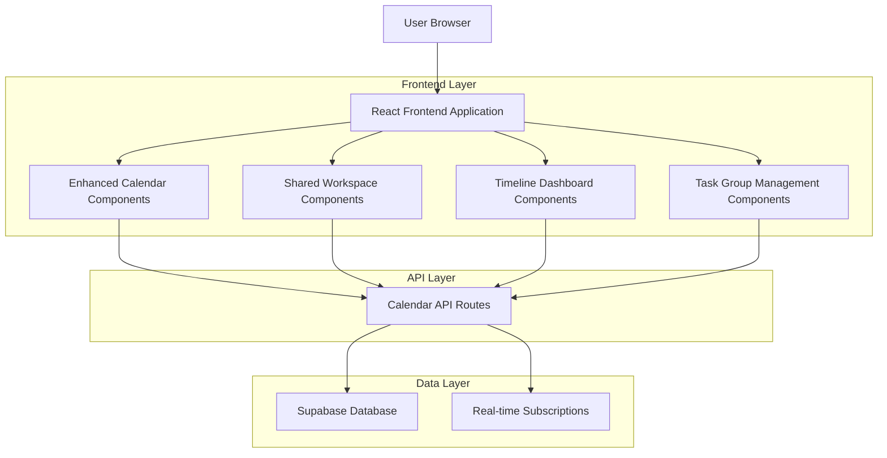
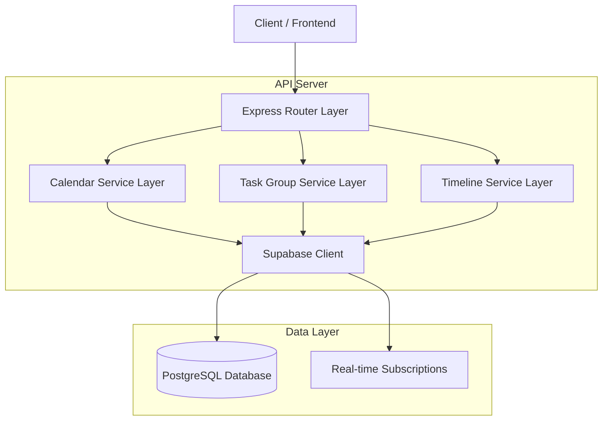
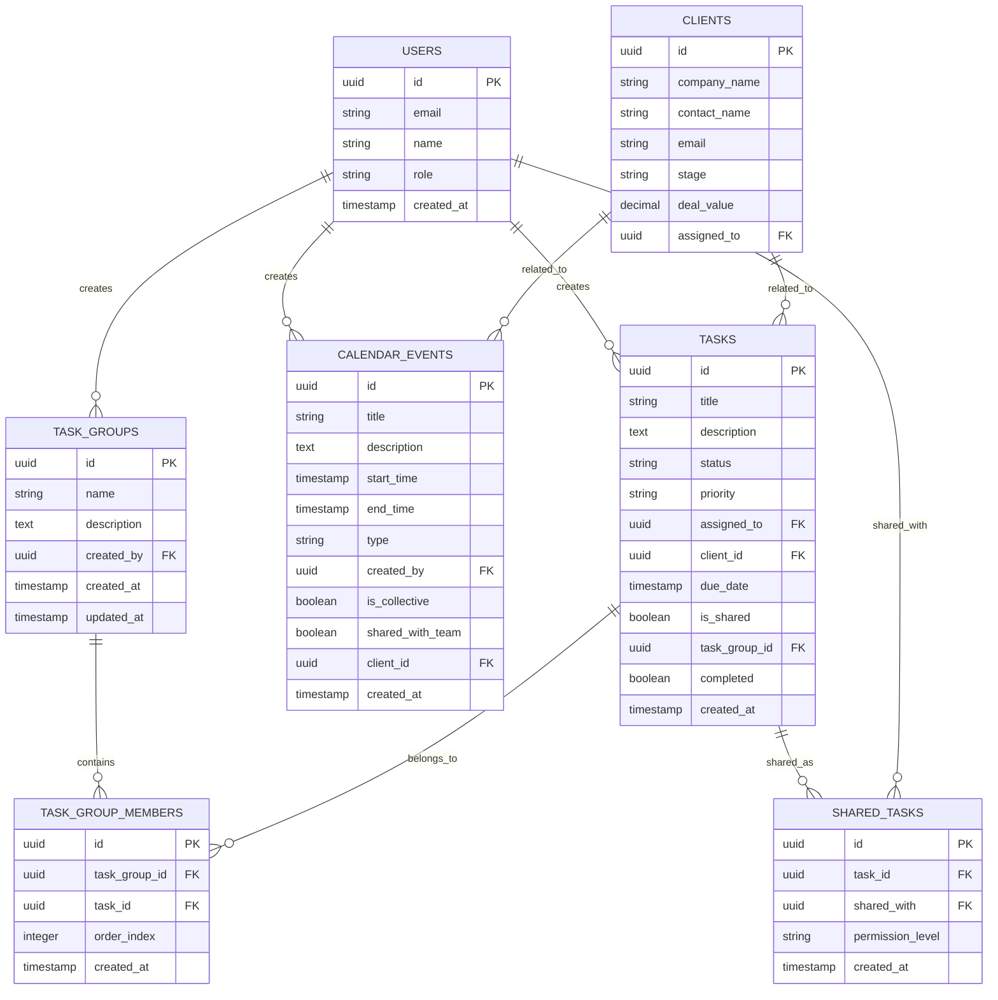

# Empty CRM Calendar Enhancement Technical Architecture

## 1. Architecture Design



## 2. Technology Description

- Frontend: React@18 + TypeScript + TailwindCSS@3 + Vite
- Backend: Express.js API routes with Supabase integration
- Database: Supabase (PostgreSQL) with real-time subscriptions
- UI Components: Lucide React icons + Custom date/time picker components
- State Management: React Context + useState/useEffect hooks
- Real-time Updates: Supabase real-time subscriptions for collaborative features

## 3. Route Definitions

| Route | Purpose |
|-------|---------|
| /calendar | Enhanced calendar page with shared tasks and timeline integration |
| /calendar/shared | Dedicated shared workspace for collaborative tasks and events |
| /calendar/timeline | Timeline dashboard with client and project views |
| /calendar/task-groups | Task group management interface |
| /calendar/timeline/client/:id | Client-specific timeline view |

## 4. API Definitions

### 4.1 Core API

#### Task Groups Management
```
GET /api/calendar/task-groups
```
Response:
| Param Name | Param Type | Description |
|------------|------------|-------------|
| success | boolean | Request success status |
| data | TaskGroup[] | Array of task group objects |

Example Response:
```json
{
  "success": true,
  "data": [
    {
      "id": "uuid",
      "name": "Client Onboarding",
      "description": "Complete client setup process",
      "created_by": "user-uuid",
      "tasks": [
        {
          "id": "task-uuid",
          "title": "Send welcome email",
          "order_index": 0
        }
      ]
    }
  ]
}
```

```
POST /api/calendar/task-groups
```
Request:
| Param Name | Param Type | isRequired | Description |
|------------|------------|------------|-------------|
| name | string | true | Task group name |
| description | string | false | Task group description |
| task_ids | string[] | false | Array of task IDs to include |

#### Shared Tasks Management
```
POST /api/calendar/tasks/:id/share
```
Request:
| Param Name | Param Type | isRequired | Description |
|------------|------------|------------|-------------|
| user_ids | string[] | true | Array of user IDs to share with |
| permission_level | string | false | Permission level (view, edit, admin) |

#### Timeline Data
```
GET /api/calendar/timeline/client/:clientId
```
Response:
| Param Name | Param Type | Description |
|------------|------------|-------------|
| success | boolean | Request success status |
| data | TimelineEvent[] | Chronological array of client events |

Example Response:
```json
{
  "success": true,
  "data": [
    {
      "id": "uuid",
      "type": "task",
      "title": "Follow up call",
      "date": "2024-01-15T10:00:00Z",
      "status": "completed",
      "assigned_to": "user-uuid"
    },
    {
      "id": "uuid",
      "type": "interaction",
      "title": "LinkedIn message sent",
      "date": "2024-01-14T14:30:00Z",
      "status": "sent"
    }
  ]
}
```

## 5. Server Architecture Diagram



## 6. Data Model

### 6.1 Data Model Definition



### 6.2 Data Definition Language

#### Task Groups Table
```sql
-- Create task_groups table
CREATE TABLE task_groups (
    id UUID PRIMARY KEY DEFAULT gen_random_uuid(),
    name VARCHAR(255) NOT NULL,
    description TEXT,
    created_by UUID REFERENCES users(id),
    created_at TIMESTAMP WITH TIME ZONE DEFAULT NOW(),
    updated_at TIMESTAMP WITH TIME ZONE DEFAULT NOW()
);

-- Create indexes
CREATE INDEX idx_task_groups_created_by ON task_groups(created_by);
CREATE INDEX idx_task_groups_created_at ON task_groups(created_at DESC);

-- Grant permissions
GRANT SELECT ON task_groups TO anon;
GRANT ALL PRIVILEGES ON task_groups TO authenticated;

-- Create RLS policy
CREATE POLICY "Users can manage task groups" ON task_groups FOR ALL TO authenticated USING (true);
```

#### Task Group Members Table
```sql
-- Create task_group_members table
CREATE TABLE task_group_members (
    id UUID PRIMARY KEY DEFAULT gen_random_uuid(),
    task_group_id UUID REFERENCES task_groups(id) ON DELETE CASCADE,
    task_id UUID REFERENCES tasks(id) ON DELETE CASCADE,
    order_index INTEGER DEFAULT 0,
    created_at TIMESTAMP WITH TIME ZONE DEFAULT NOW()
);

-- Create indexes
CREATE INDEX idx_task_group_members_group_id ON task_group_members(task_group_id);
CREATE INDEX idx_task_group_members_task_id ON task_group_members(task_id);
CREATE INDEX idx_task_group_members_order ON task_group_members(task_group_id, order_index);

-- Grant permissions
GRANT SELECT ON task_group_members TO anon;
GRANT ALL PRIVILEGES ON task_group_members TO authenticated;

-- Create RLS policy
CREATE POLICY "Users can manage task group members" ON task_group_members FOR ALL TO authenticated USING (true);
```

#### Shared Tasks Table
```sql
-- Create shared_tasks table
CREATE TABLE shared_tasks (
    id UUID PRIMARY KEY DEFAULT gen_random_uuid(),
    task_id UUID REFERENCES tasks(id) ON DELETE CASCADE,
    shared_with UUID REFERENCES users(id),
    permission_level VARCHAR(20) DEFAULT 'view' CHECK (permission_level IN ('view', 'edit', 'admin')),
    created_at TIMESTAMP WITH TIME ZONE DEFAULT NOW()
);

-- Create indexes
CREATE INDEX idx_shared_tasks_task_id ON shared_tasks(task_id);
CREATE INDEX idx_shared_tasks_shared_with ON shared_tasks(shared_with);
CREATE UNIQUE INDEX idx_shared_tasks_unique ON shared_tasks(task_id, shared_with);

-- Grant permissions
GRANT SELECT ON shared_tasks TO anon;
GRANT ALL PRIVILEGES ON shared_tasks TO authenticated;

-- Create RLS policy
CREATE POLICY "Users can manage shared tasks" ON shared_tasks FOR ALL TO authenticated USING (true);
```

#### Modify Existing Tables
```sql
-- Add new columns to tasks table
ALTER TABLE tasks ADD COLUMN IF NOT EXISTS is_shared BOOLEAN DEFAULT false;
ALTER TABLE tasks ADD COLUMN IF NOT EXISTS task_group_id UUID REFERENCES task_groups(id);
ALTER TABLE tasks ADD COLUMN IF NOT EXISTS completed BOOLEAN DEFAULT false;

-- Add new columns to calendar_events table
ALTER TABLE calendar_events ADD COLUMN IF NOT EXISTS shared_with_team BOOLEAN DEFAULT false;
ALTER TABLE calendar_events ADD COLUMN IF NOT EXISTS client_id UUID REFERENCES clients(id);

-- Create additional indexes
CREATE INDEX IF NOT EXISTS idx_tasks_is_shared ON tasks(is_shared);
CREATE INDEX IF NOT EXISTS idx_tasks_task_group_id ON tasks(task_group_id);
CREATE INDEX IF NOT EXISTS idx_calendar_events_client_id ON calendar_events(client_id);
CREATE INDEX IF NOT EXISTS idx_calendar_events_shared ON calendar_events(shared_with_team);
```

#### Initial Data
```sql
-- Insert sample task groups
INSERT INTO task_groups (name, description, created_by) VALUES
('Client Onboarding', 'Complete client setup and initial engagement process', (SELECT id FROM users WHERE email = 'will@emptyad.com')),
('Product Demo Preparation', 'Prepare and deliver product demonstrations', (SELECT id FROM users WHERE email = 'beck@emptyad.com')),
('Technical Implementation', 'Technical setup and configuration tasks', (SELECT id FROM users WHERE email = 'roman@emptyad.com'));

-- Update existing tasks to be part of task groups
UPDATE tasks SET 
    task_group_id = (SELECT id FROM task_groups WHERE name = 'Client Onboarding' LIMIT 1),
    is_shared = true,
    completed = false
WHERE title LIKE '%follow up%' OR title LIKE '%meeting%';

UPDATE tasks SET 
    task_group_id = (SELECT id FROM task_groups WHERE name = 'Product Demo Preparation' LIMIT 1),
    is_shared = true,
    completed = false
WHERE title LIKE '%demo%' OR title LIKE '%presentation%';
```

## 7. Component Implementation Strategy

### 7.1 Enhanced Date-Time Components

#### CalendarDropdown Component
- Custom React component replacing `datetime-local` inputs
- Features: Month/year navigation, date highlighting, keyboard navigation
- Props: `value`, `onChange`, `minDate`, `maxDate`, `disabled`
- Styling: TailwindCSS with custom calendar grid layout

#### TimePicker Component
- Dual dropdown interface for hour/minute selection
- Features: 12-hour format with AM/PM, 15-minute intervals, timezone display
- Props: `value`, `onChange`, `format`, `interval`, `disabled`
- Integration: Works seamlessly with CalendarDropdown

### 7.2 Real-time Collaboration Features

#### Supabase Real-time Integration
```typescript
// Real-time subscription for shared tasks
const subscribeToSharedTasks = () => {
  return supabase
    .channel('shared-tasks')
    .on('postgres_changes', {
      event: '*',
      schema: 'public',
      table: 'shared_tasks'
    }, handleSharedTaskChange)
    .subscribe();
};

// Real-time subscription for task updates
const subscribeToTaskUpdates = () => {
  return supabase
    .channel('task-updates')
    .on('postgres_changes', {
      event: 'UPDATE',
      schema: 'public',
      table: 'tasks'
    }, handleTaskUpdate)
    .subscribe();
};
```

### 7.3 Performance Optimization

- **Lazy Loading**: Timeline components load data on-demand
- **Caching**: Client-side caching for frequently accessed timeline data
- **Pagination**: Timeline views implement infinite scroll with pagination
- **Debouncing**: Search and filter inputs use debounced API calls
- **Memoization**: React.memo and useMemo for expensive timeline calculations

## 8. Security Considerations

### 8.1 Data Access Control
- Row Level Security (RLS) policies for all new tables
- Permission-based access for shared tasks (view, edit, admin)
- User authentication required for all calendar enhancement features

### 8.2 Real-time Security
- Supabase RLS policies apply to real-time subscriptions
- Channel-level access control for collaborative features
- User session validation for all real-time operations

## 9. Deployment Strategy

### 9.1 Database Migration
1. Create new tables (task_groups, task_group_members, shared_tasks)
2. Add new columns to existing tables (tasks, calendar_events)
3. Create indexes and RLS policies
4. Insert initial data and update existing records

### 9.2 Frontend Deployment
1. Deploy new React components with feature flags
2. Gradual rollout of enhanced date-time pickers
3. Enable shared workspace features after database migration
4. Monitor real-time subscription performance

### 9.3 Testing Strategy
- Unit tests for new React components
- Integration tests for API endpoints
- Real-time functionality testing with multiple users
- Performance testing for timeline data loading
- Cross-browser compatibility testing for date-time pickers