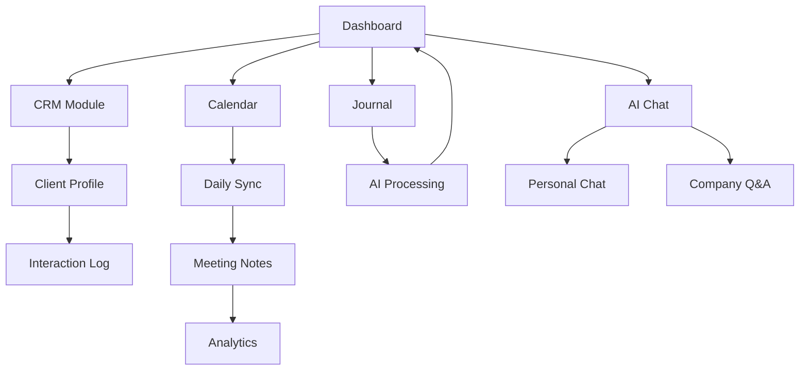

# Empty Operations CRM PWA - Product Requirements Document

## 1. Product Overview
Empty Operations CRM PWA is a unified interface combining CRM management, calendar coordination, task tracking, personal journals, and AI-powered assistance for a 3-person team at Empty.
- Solves the problem of fragmented workflow management by integrating LinkedIn/email outreach, meeting coordination, task management, and AI-driven insights into one cohesive platform.
- Target market: Small teams requiring comprehensive operations management with AI optimization for maximum efficiency and revenue growth.

## 2. Core Features

### 2.1 User Roles
| Role | Registration Method | Core Permissions |
|------|---------------------|------------------|
| CEO (William Walsh) | Pre-configured account | Full access to all modules, team oversight, revenue forecasting |
| CGO (Beck Majdell) | Pre-configured account | CRM management, sales analytics, client interactions, team calendar |
| CTO (M.A. Roman) | Pre-configured account | Technical operations, system management, AI chat engine, development tasks |

### 2.2 Feature Module
Our Empty CRM requirements consist of the following main pages:
1. **Dashboard**: AI-generated daily priorities, pipeline overview, task summary, team status.
2. **CRM Module**: Client profiles, interaction tracking, funnel analytics, AI optimization.
3. **Calendar**: Individual/collective views, daily sync tabs, task integration, scheduling framework.
4. **Journal**: Personal daily entries, AI processing, cross-team insights.
5. **Meeting Notes**: AI summaries, daily/weekly/monthly recaps, action items.
6. **AI Chat Engine**: Company-wide Q&A, contextual queries, personal assistant.
7. **Analytics**: Pipeline forecasting, conversion tracking, performance metrics.
8. **Settings**: User preferences, AI configuration, notification management.

### 2.3 Page Details
| Page Name | Module Name | Feature description |
|-----------|-------------|---------------------|
| Dashboard | Priority Panel | Display AI-generated top 3 daily priorities based on CRM, tasks, and journal analysis |
| Dashboard | Pipeline Overview | Show 30/60-day revenue forecast with weighted probabilities and stage conversions |
| Dashboard | Team Status | Real-time view of each member's current focus and availability |
| CRM Module | Client Profiles | Store complete interaction history with LinkedIn, email, call, and meeting logs |
| CRM Module | Interaction Tracking | Log connection requests, messages, replies with status progression (Connect → Reply → Meeting → Proposal → Closed) |
| CRM Module | AI Optimization | Track message performance, recommend improved scripts, suggest follow-up timing |
| CRM Module | Duplicate Detection | Identify and merge duplicate contacts, warn about lead conflicts between team members |
| Calendar | Individual View | Personal calendar with private tasks visible to team for coordination |
| Calendar | Collective View | Shared team calendar with daily sync tabs, collective tasks, and company time blocks |
| Calendar | Task Management | Create, assign, and track tasks with status workflow (Pending → In Progress → Completed) |
| Calendar | Daily Sync Tabs | Auto-created 9AM meeting slots with note storage and AI summary generation |
| Journal | Daily Prompts | Structured entries for Sales/Marketing/Ops/Tech accomplishments plus free-form thoughts |
| Journal | AI Processing | Analyze entries for cross-team needs, priority suggestions, and idea preservation |
| Meeting Notes | AI Summaries | Generate daily, weekly, and monthly summaries from meeting transcriptions |
| Meeting Notes | Action Items | Auto-extract and assign follow-up tasks with calendar integration |
| AI Chat Engine | Personal Chat | Individual AI assistant for queries about personal tasks, schedule, and priorities |
| AI Chat Engine | Company Q&A | Team-wide knowledge base for CRM status, pipeline, goals, and operational queries |
| Analytics | Funnel Metrics | Track conversion rates at each stage with historical performance data |
| Analytics | Forecasting | Revenue predictions based on pipeline stage, close rates, and deal size |
| Settings | User Profile | Manage personal information, notification preferences, and AI settings |
| Settings | System Config | Configure AI model parameters, integration settings, and data retention |

## 3. Core Process

**Daily Workflow:**
1. Morning: AI generates top 3 priorities → 9AM sync meeting → Daily planning
2. Work blocks: Sales (10-12), Marketing (1-3), Meetings (3-6), Tech/Ops (6-7:30)
3. Evening: Journal entries → AI processes for next-day recommendations

**CRM Process:**
1. Lead identification → LinkedIn connection/email outreach → Response tracking → Meeting booking → Proposal → Close
2. AI monitors each stage, suggests follow-ups, optimizes messaging, prevents conflicts

**Team Coordination:**
1. Individual work with shared visibility → Collective planning → Cross-team collaboration based on journal insights

## 4. User Interface Design

### 4.1 Design Style
- **Primary Colors**: #d381b5 (pink), #b6346b (magenta), #9c2a5a (deep rose)
- **Button Style**: Rounded corners with gradient effects, hover animations
- **Font**: Modern sans-serif (Inter/Roboto), 14px base, 18px headers, 12px captions
- **Layout**: Card-based design with top navigation, sidebar for modules, responsive grid system
- **Icons**: Minimalist line icons with pink accent colors, consistent 24px sizing

### 4.2 Page Design Overview
| Page Name | Module Name | UI Elements |
|-----------|-------------|-------------|
| Dashboard | Priority Panel | Gradient cards (#d381b5 to #b6346b), bold typography, progress indicators |
| Dashboard | Pipeline Overview | Interactive charts with pink accents, revenue bands, conversion funnels |
| CRM Module | Client Profiles | Contact cards with status badges, interaction timeline, pink action buttons |
| Calendar | Collective View | Time-block grid with color coding, drag-drop tasks, pink event markers |
| Journal | Daily Prompts | Clean text areas with pink borders, auto-save indicators, thought bubbles |
| AI Chat | Chat Interface | Modern chat bubbles, pink user messages, white AI responses, typing indicators |
| Analytics | Dashboard | Interactive charts and graphs with pink/magenta color scheme, KPI cards |

### 4.3 Responsiveness
Desktop-first design with mobile-adaptive breakpoints. Touch-optimized interactions for mobile users, with swipe gestures for calendar navigation and pull-to-refresh functionality.