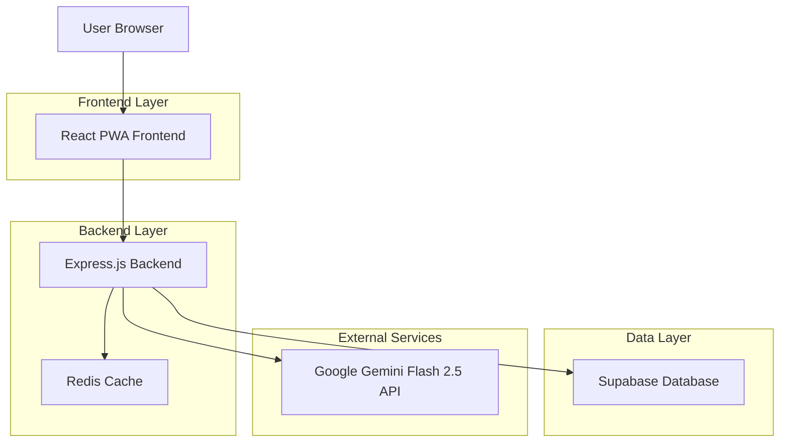
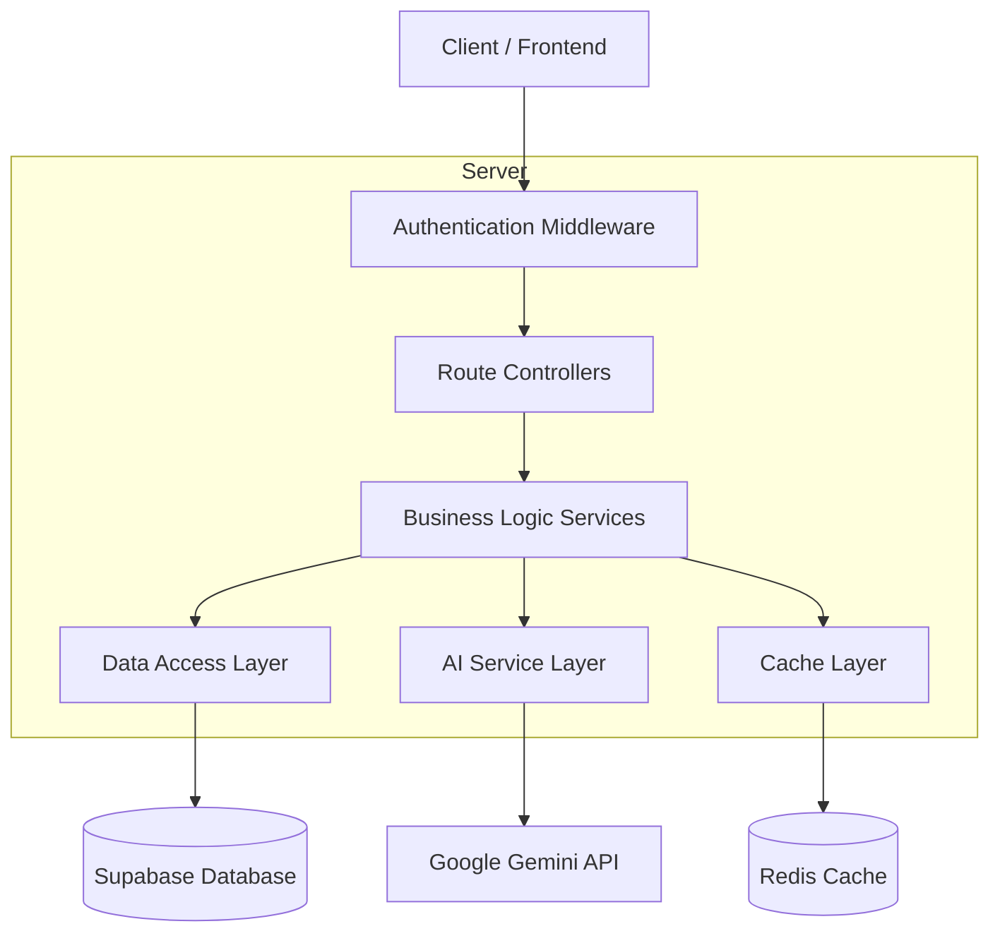
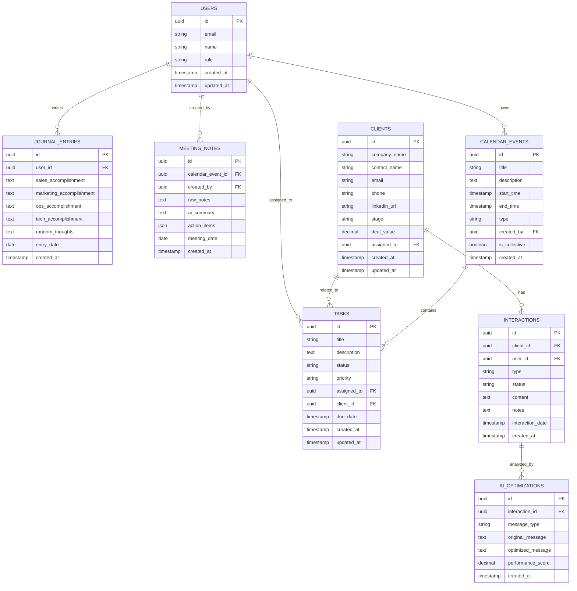

# Empty Operations CRM PWA - Technical Architecture Document

## 1. Architecture Design



## 2. Technology Description

* Frontend: React\@18 + TypeScript + Tailwind CSS\@3 + Vite + PWA Service Worker

* Backend: Express.js\@4 + TypeScript + Node.js\@22

* Database: Supabase (PostgreSQL)

* Cache: Redis (for session management and AI response caching)

* AI Service: Google Gemini Flash 2.5 API

* Authentication: Supabase Auth

## 3. Route Definitions

| Route                | Purpose                                                  |
| -------------------- | -------------------------------------------------------- |
| /                    | Dashboard with AI priorities and pipeline overview       |
| /login               | Authentication page for team members                     |
| /crm                 | CRM module with client profiles and interaction tracking |
| /crm/client/:id      | Individual client profile with full interaction history  |
| /calendar            | Calendar view with individual and collective scheduling  |
| /calendar/sync/:date | Daily sync meeting notes and AI summaries                |
| /journal             | Personal journal with daily prompts and AI insights      |
| /meetings            | Meeting notes with AI-generated summaries                |
| /chat                | AI chat engine for company-wide Q\&A                     |
| /analytics           | Pipeline forecasting and performance metrics             |
| /settings            | User preferences and system configuration                |

## 4. API Definitions

### 4.1 Core API

**Authentication**

```
POST /api/auth/login
```

Request:

| Param Name | Param Type | isRequired | Description        |
| ---------- | ---------- | ---------- | ------------------ |
| email      | string     | true       | User email address |
| password   | string     | true       | User password      |

Response:

| Param Name | Param Type | Description           |
| ---------- | ---------- | --------------------- |
| success    | boolean    | Authentication status |
| user       | object     | User profile data     |
| token      | string     | JWT access token      |

**CRM Management**

```
GET /api/crm/clients
POST /api/crm/clients
PUT /api/crm/clients/:id
POST /api/crm/interactions
```

**Calendar & Tasks**

```
GET /api/calendar/events
POST /api/calendar/events
PUT /api/tasks/:id/status
GET /api/calendar/sync/:date
```

**AI Services**

```
POST /api/ai/priorities
POST /api/ai/summarize
POST /api/ai/chat
POST /api/ai/optimize-message
```

**Journal & Notes**

```
GET /api/journal/entries
POST /api/journal/entries
GET /api/meetings/notes/:date
POST /api/meetings/notes
```

## 5. Server Architecture Diagram



## 6. Data Model

### 6.1 Data Model Definition



### 6.2 Data Definition Language

**Users Table**

```sql
CREATE TABLE users (
    id UUID PRIMARY KEY DEFAULT gen_random_uuid(),
    email VARCHAR(255) UNIQUE NOT NULL,
    name VARCHAR(100) NOT NULL,
    role VARCHAR(50) NOT NULL CHECK (role IN ('CEO', 'CGO', 'CTO')),
    created_at TIMESTAMP WITH TIME ZONE DEFAULT NOW(),
    updated_at TIMESTAMP WITH TIME ZONE DEFAULT NOW()
);

-- Grant permissions
GRANT SELECT ON users TO anon;
GRANT ALL PRIVILEGES ON users TO authenticated;

-- Initial data
INSERT INTO users (email, name, role) VALUES
('will@emptyad.com', 'William Walsh', 'CEO'),
('beck@emptyad.com', 'Beck Majdell', 'CGO'),
('roman@emptyad.com', 'M.A. Roman', 'CTO');
```

**Clients Table**

```sql
CREATE TABLE clients (
    id UUID PRIMARY KEY DEFAULT gen_random_uuid(),
    company_name VARCHAR(255) NOT NULL,
    contact_name VARCHAR(255),
    email VARCHAR(255),
    phone VARCHAR(50),
    linkedin_url TEXT,
    stage VARCHAR(50) DEFAULT 'prospect' CHECK (stage IN ('prospect', 'connected', 'replied', 'meeting', 'proposal', 'closed', 'lost')),
    deal_value DECIMAL(10,2),
    assigned_to UUID REFERENCES users(id),
    created_at TIMESTAMP WITH TIME ZONE DEFAULT NOW(),
    updated_at TIMESTAMP WITH TIME ZONE DEFAULT NOW()
);

CREATE INDEX idx_clients_assigned_to ON clients(assigned_to);
CREATE INDEX idx_clients_stage ON clients(stage);
GRANT SELECT ON clients TO anon;
GRANT ALL PRIVILEGES ON clients TO authenticated;
```

**Interactions Table**

```sql
CREATE TABLE interactions (
    id UUID PRIMARY KEY DEFAULT gen_random_uuid(),
    client_id UUID REFERENCES clients(id) ON DELETE CASCADE,
    user_id UUID REFERENCES users(id),
    type VARCHAR(50) NOT NULL CHECK (type IN ('linkedin_connection', 'linkedin_message', 'email', 'phone_call', 'meeting')),
    status VARCHAR(50) DEFAULT 'sent' CHECK (status IN ('sent', 'received', 'replied', 'ignored', 'completed')),
    content TEXT,
    notes TEXT,
    interaction_date TIMESTAMP WITH TIME ZONE DEFAULT NOW(),
    created_at TIMESTAMP WITH TIME ZONE DEFAULT NOW()
);

CREATE INDEX idx_interactions_client_id ON interactions(client_id);
CREATE INDEX idx_interactions_user_id ON interactions(user_id);
CREATE INDEX idx_interactions_date ON interactions(interaction_date DESC);
GRANT SELECT ON interactions TO anon;
GRANT ALL PRIVILEGES ON interactions TO authenticated;
```

**Tasks Table**

```sql
CREATE TABLE tasks (
    id UUID PRIMARY KEY DEFAULT gen_random_uuid(),
    title VARCHAR(255) NOT NULL,
    description TEXT,
    status VARCHAR(50) DEFAULT 'pending' CHECK (status IN ('pending', 'in_progress', 'completed')),
    priority VARCHAR(20) DEFAULT 'medium' CHECK (priority IN ('low', 'medium', 'high')),
    assigned_to UUID REFERENCES users(id),
    client_id UUID REFERENCES clients(id),
    due_date TIMESTAMP WITH TIME ZONE,
    created_at TIMESTAMP WITH TIME ZONE DEFAULT NOW(),
    updated_at TIMESTAMP WITH TIME ZONE DEFAULT NOW()
);

CREATE INDEX idx_tasks_assigned_to ON tasks(assigned_to);
CREATE INDEX idx_tasks_status ON tasks(status);
CREATE INDEX idx_tasks_due_date ON tasks(due_date);
GRANT SELECT ON tasks TO anon;
GRANT ALL PRIVILEGES ON tasks TO authenticated;
```

**Calendar Events Table**

```sql
CREATE TABLE calendar_events (
    id UUID PRIMARY KEY DEFAULT gen_random_uuid(),
    title VARCHAR(255) NOT NULL,
    description TEXT,
    start_time TIMESTAMP WITH TIME ZONE NOT NULL,
    end_time TIMESTAMP WITH TIME ZONE NOT NULL,
    type VARCHAR(50) DEFAULT 'meeting' CHECK (type IN ('meeting', 'sync', 'block', 'personal')),
    created_by UUID REFERENCES users(id),
    is_collective BOOLEAN DEFAULT false,
    created_at TIMESTAMP WITH TIME ZONE DEFAULT NOW()
);

CREATE INDEX idx_calendar_events_start_time ON calendar_events(start_time);
CREATE INDEX idx_calendar_events_created_by ON calendar_events(created_by);
GRANT SELECT ON calendar_events TO anon;
GRANT ALL PRIVILEGES ON calendar_events TO authenticated;
```

**Journal Entries Table**

```sql
CREATE TABLE journal_entries (
    id UUID PRIMARY KEY DEFAULT gen_random_uuid(),
    user_id UUID REFERENCES users(id) ON DELETE CASCADE,
    sales_accomplishment TEXT,
    marketing_accomplishment TEXT,
    ops_accomplishment TEXT,
    tech_accomplishment TEXT,
    random_thoughts TEXT,
    entry_date DATE NOT NULL,
    created_at TIMESTAMP WITH TIME ZONE DEFAULT NOW()
);

CREATE UNIQUE INDEX idx_journal_entries_user_date ON journal_entries(user_id, entry_date);
GRANT SELECT ON journal_entries TO anon;
GRANT ALL PRIVILEGES ON journal_entries TO authenticated;
```

**Meeting Notes Table**

```sql
CREATE TABLE meeting_notes (
    id UUID PRIMARY KEY DEFAULT gen_random_uuid(),
    calendar_event_id UUID REFERENCES calendar_events(id),
    created_by UUID REFERENCES users(id),
    raw_notes TEXT,
    ai_summary TEXT,
    action_items JSONB,
    meeting_date DATE NOT NULL,
    created_at TIMESTAMP WITH TIME ZONE DEFAULT NOW()
);

CREATE INDEX idx_meeting_notes_date ON meeting_notes(meeting_date DESC);
CREATE INDEX idx_meeting_notes_created_by ON meeting_notes(created_by);
GRANT SELECT ON meeting_notes TO anon;
GRANT ALL PRIVILEGES ON meeting_notes TO authenticated;
```

**AI Optimizations Table**

```sql
CREATE TABLE ai_optimizations (
    id UUID PRIMARY KEY DEFAULT gen_random_uuid(),
    interaction_id UUID REFERENCES interactions(id),
    message_type VARCHAR(50) NOT NULL,
    original_message TEXT,
    optimized_message TEXT,
    performance_score DECIMAL(3,2),
    created_at TIMESTAMP WITH TIME ZONE DEFAULT NOW()
);

CREATE INDEX idx_ai_optimizations_interaction_id ON ai_optimizations(interaction_id);
CREATE INDEX idx_ai_optimizations_performance ON ai_optimizations(performance_score DESC);
GRANT SELECT ON ai_optimizations TO anon;
GRANT ALL PRIVILEGES ON ai_optimizations TO authenticated;
```

